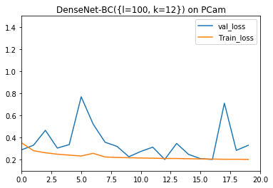

# Densely Connected Convolutional Networks on PCam Dataset

This is the PyTorch implementation of the paper [Densely Connected Convolutional Networks](https://arxiv.org/abs/1608.06993) by G. Huang, Z. Liu, K. Weinberger, and L. van der Maaten.  


<p align="center">
 
</p>

## Requirements

* Python 3
* PyTorch (newest version)
* tqdm
* tensorboard_logger

## Usage

This implementation currently supports training on the CIFAR-10 and PCam datasets.

Basically, when training a model, you should specify the total number of layers `num_layers_total` in the model. You should specify a desired dropout rate `--dropout_rate` to turn off data augmentation, which is performed by default.

When testing a model, reuse whatever command you used to train the model and add the `--is_train=False` argument. This will load the model with the best validation accuracy and test it on the test set.

You can use tensorboard to view losses and accuracy by setting the `use_tensorboard` argument in which case you need to run `tensorboard --logdir=./logs/` in a separate shell.

Finally, to see all possible options, run:

```
python main.py --help
```

Here's an example command for training a DenseNet-BC-100 architecture with a growth rate of 12, data augmentation, tensorboard visualization and with GPU:

```
python main.py --num_layers_total=100 --bottleneck=True --compression=0.5 --num_gpu=1 --use_tensorboard=True
```

## Performance

I trained DenseNet-40 and DenseNet-BC-100 variants on the CIFAR-10 and PCam datasets, Training with CIFAR-10 took 2 days to complete on a FloydHub Tesla K80 1GPU and  for training with PCam dataset, I used Nvidia Docker cloud GPU.


Here are some  visualizations :

<p align="center">
 
  
</p>

<p align="center">
 
 
</p>

<p align="center">
 
  
</p>


## References

* Thanks to the PyTorch ImageNet [training example](https://github.com/pytorch/examples/tree/master/imagenet) for helping me code the Trainer class.
* Thanks to [Andreas Veit](https://github.com/andreasveit/densenet-pytorch) pytorch implentation for DenseNets
